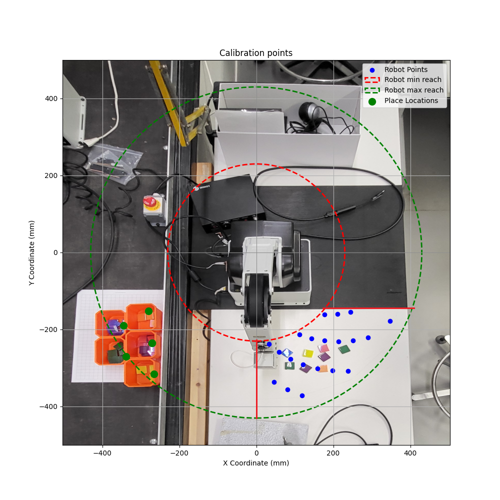

<h1>The "GUI-improvements" branch is most up to date, but it has not been tested on campus with the real robot.</h1>

<h2>File paths that need to be changed:</h2>

<h3>mainV2.py</h3>

File Path for Transformation Matrix:
Update the file path to point to the correct location of the transformation matrix:

    transformation_matrix = np.loadtxt(r"C:\path\to\your\transformation_matrix.txt")

<h3>calibrationV2.py</h3>

File Path for Transformation Matrix:
Ensure the path to the transformation matrix is correct. This path must be consistent with where your transformation matrix file is located.

    np.savetxt(r"C:\path\to\your\transformation_matrix.txt", transformation_matrix)

<h3>main_GUI.py</h3>

File Paths for Scripts:
Update the paths to point to the correct location of the calibration and main scripts:

    CALIBRATION_SCRIPT_PATH = r"C:\path\to\your\calibrationV2.py"
    MAIN_SCRIPT_PATH = r"C:\path\to\your\mainV2.py"

<h2>Robot picking area</h2>

The robot's picking area is the approximately 30-degree area between x=0 and y=-200 within the robot's minimum and maximum reach.

(Image not to scale)

This is the area where the calibration points are. The robot will not be accurate outside of this area, and calibration is not done left of x=0 because of poor lighting that affects image processing.

    # Predefined calibration points
    robot_points = [
        [32.48, -237.79, -169, 0], 
        [111.85, -212.34, -169, 0], 
        [177.73, -161.28, -169, 0], 
        [58.61, -258.44, -169, 0], 
        [143.47, -222.80, -169, 0], 
        [211.02, -160.30, -169, 0], 
        [88.55, -276.15, -169, 0], 
        [177.66, -229.21, -169, 0], 
        [245.34, -154.63, -169, 0], 
        [121.96, -290.43, -169, 0], 
        [213.94, -231.21, -169, 0], 
        [46.02, -336.87, -169, 0], 
        [158.46, -300.82, -169, 0], 
        [251.79, -228.48, -169, 0], 
        [80.73, -355.96, -169, 0], 
        [197.61, -306.88, -169, 0], 
        [290.65, -220.79, -169, 0], 
        [119.08, -371.38, -169, 0], 
        [238.92, -308.25, -169, 0], 
        [346.80, -178.40, -169, 0]
    ]
